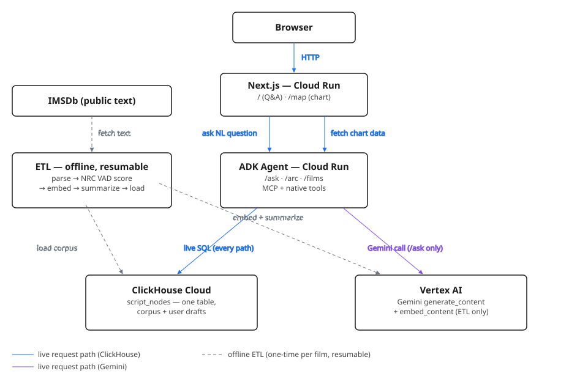

# Agentic Cinema — Screenplay Structural Map

An AI agent that gives a **screenwriter-in-revision** an interactive emotional/structural map of their
draft, with **percentile comparisons against a produced-film corpus** ("this scene is in the bottom 8%
for conflict density at this act-position in produced thrillers") — never opaque scores.

Built for the **Agentic Cinema hackathon — ClickHouse track**.

- **AI:** Google Gemini via Vertex AI (Agent Development Kit)
- **Data + retrieval:** ClickHouse, queried **at runtime via the ClickHouse MCP server**
- **Key idea:** a screenplay ships a RAPTOR-style retrieval tree _for free_ from its formatting
  (line → scene → sequence → act → film). One `script_nodes` table holds both the corpus and the
  user's draft; comparison is one partition-pruned query.

> **Design invariant:** every number the user sees comes from a live SQL query. Numbers are SQL
> aggregates; the LLM only writes prose and embeddings. No client-side analytics on cached data.



Every request-time path queries ClickHouse directly; only the conversational `/ask` route also
calls Gemini — the chart's `/arc` and `/films` endpoints skip the LLM entirely, since firing an
LLM call on every hover/drill would be slow, costly, and non-deterministic for what's just a
parameterized SELECT. The offline ETL pipeline (dashed) is the only place embeddings and
summaries get generated, run once per corpus film, never at request time.

## Live

- **App:** https://agent-cinema-web-742393615246.us-central1.run.app
- **Agent API:** https://screenplay-agent-742393615246.us-central1.run.app

Both run on Cloud Run (`us-central1`), backed by ClickHouse Cloud and Vertex AI.

## Repository layout

| Path                   | What                                                                                                   |
| ----------------------- | ------------------------------------------------------------------------------------------------------ |
| `agent/`               | Python ADK agent + FastAPI adapter (`server.py`): the conversational endpoint (`/ask`), the direct-SQL percentile/similarity tools (`tools.py`), and the chart data endpoints (`data_api.py`, `/films` + `/arc`). Deploys to Cloud Run via `Dockerfile` / `deploy.sh`. |
| `web/`                 | Next.js frontend: a Q&A page (`/`) and the interactive structural/emotional map (`/map`). Deploys to Cloud Run via `Dockerfile`.                                                    |
| `etl/`                 | Offline corpus pipeline (`screenplay_etl/`): IMSDb fetch → scene parse → NRC VAD score → Vertex embed → Gemini summarize → ClickHouse load. Run with `uv run python -m screenplay_etl.run` from `etl/`.                        |
| `infra/clickhouse/`    | `schema.sql` (the `script_nodes` table) + `seed.sql` (Slice-1 skeleton data — superseded by the real ETL-loaded corpus once Slice 2 finishes).                          |
| `docs/plans/`          | The implementation spec.                                                                               |
| `features/PROGRESS.md` | Living build tracker — **read this first** to see current state.                                       |

## Quick start (local dev)

Prerequisites: a **ClickHouse Cloud** service, a **Google Cloud** project with Vertex AI enabled, and
`gcloud auth application-default login` completed.

```bash
# 1. Create the table and seed it (paste into ClickHouse Cloud SQL console, or via clickhouse client)
#    infra/clickhouse/schema.sql  then  infra/clickhouse/seed.sql

# 2. Agent (Python)
cd agent
cp .env.example .env         # fill in ClickHouse + GCP values
uv sync
uv run pytest                # runs the offline unit tests
uv run uvicorn server:app --reload --port 8000

# 3. Web (Next.js), in another terminal
cd web
cp .env.example .env.local   # set AGENT_URL=http://localhost:8000
npm install
npm run dev                  # http://localhost:3000
```

Ask _"What is the average conflict of the scenes?"_ on `/` — the agent turns it into a `SELECT` run
through the ClickHouse MCP server, and the UI shows both the answer and the SQL that produced it.
Visit `/map` to explore the interactive structural/emotional chart: pick a film, drill act → sequence
→ scene, every point backed by a live query shown in its own "Show SQL" panel.

### Loading the corpus (Slice 2)

`/map` and the percentile/similarity tools need real films loaded. From `etl/`:

```bash
cp ../agent/.env .env   # or point at the same ClickHouse creds another way
uv sync
uv run python -m screenplay_etl.run          # loads the curated ~25-film list (films.py)
uv run python -m screenplay_etl.run --verify # checks the AVG(children) invariant, row counts, embedding dims
```

Resumable by default — re-running skips films already in ClickHouse (`--force` to reprocess).
Scoring uses the **NRC VAD Lexicon** (Mohammad, NRC Canada) — free for non-commercial research use;
the lexicon file itself is downloaded to `etl/data/` (gitignored) rather than committed, per its own
terms. See `etl/screenplay_etl/lexicon.py` for the download link if `etl/data/` is missing.

### Testing the agent endpoint

PowerShell's `curl` is an alias for `Invoke-WebRequest` and mangles JSON — use one of these instead:

```powershell
# PowerShell (recommended)
Invoke-RestMethod -Uri "http://localhost:8000/ask" `
  -Method Post `
  -ContentType "application/json" `
  -Body '{"message":"What is the average conflict of the scenes?"}'

# Or force the real curl binary
curl.exe -s localhost:8000/ask `
  -H "content-type: application/json" `
  -d '{\"message\":\"What is the average conflict of the scenes?\"}'

# Health check
curl.exe http://localhost:8000/health
```

## Troubleshooting

### `WinError 10013` — port already in use

Port 8080 is commonly held by Apache (`httpd.exe`) on Windows. The agent defaults to **8000**.

```powershell
# Confirm what's on a port
netstat -ano | findstr :8080

# Stop Apache if you don't need it
net stop Apache2.4
```

### `API key not valid` — Vertex AI auth failure

Even though `GOOGLE_GENAI_USE_VERTEXAI=TRUE` is set, the SDK falls back to an API key when
Application Default Credentials (ADC) are missing or expired. Fix:

```powershell
# One-time login (opens browser)
gcloud auth application-default login

# Verify it works
gcloud auth application-default print-access-token

# Also confirm your project ID is correct
gcloud config get-value project
```

The project ID in `.env` must match your actual GCP project that has **Vertex AI API enabled**.

## Deployment

Both `agent/` and `web/` deploy to Cloud Run as plain Docker containers:

```bash
cd agent && bash deploy.sh   # enables APIs, stores CLICKHOUSE_PASSWORD in Secret Manager, deploys
cd web && gcloud run deploy agent-cinema-web --source=. --region=us-central1 \
  --allow-unauthenticated --set-env-vars="AGENT_URL=<the agent's Cloud Run URL>"
```

See `features/PROGRESS.md`'s Session 5 log for the IAM grants a fresh/auto-provisioned GCP project
needs before `gcloud run deploy --source` will succeed (Cloud Build's default service account isn't
always pre-authorized to read build sources or push to Artifact Registry on such projects).

## Attribution

Scene valence/arousal scoring uses the **NRC Valence, Arousal, and Dominance (VAD) Lexicon**
(Mohammad, 2018/2025), © National Research Council Canada, used here for non-commercial research
under its terms — see https://saifmohammad.com/WebPages/nrc-vad.html. Only derived per-scene scores
are stored; the lexicon itself is never redistributed.

## Status

See [`features/PROGRESS.md`](features/PROGRESS.md). Currently: **Slices 1, 3, 4 complete; Slice 2
(corpus ETL) finishing its full load; a complete, demo-able product already exists.**

## License

MIT — see [`LICENSE`](LICENSE).
